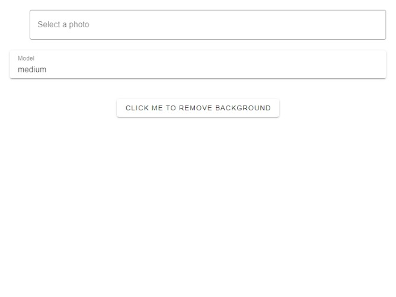

# Background Removal App

## Description
It's build with tauri and vue. It's a simple app that removes the background of an image. 


## Getting Started
### Install Dependencies(pnpm)
```bash

> pnpm i
> sh copy_model.sh
> npm run exe

```

## Screenshots



## Download
[Download Windows Client](https://github.com/citizenll/background-removal-app/releases)